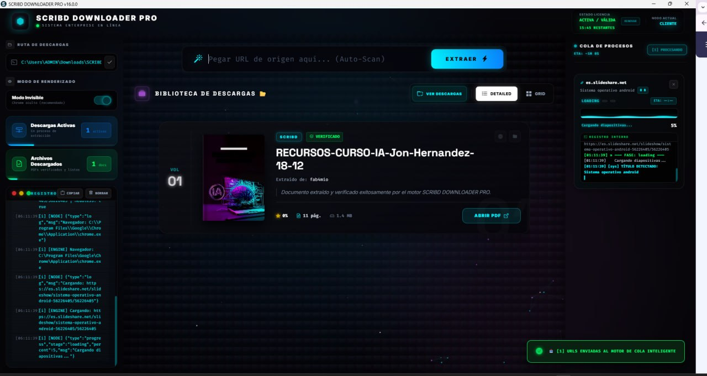
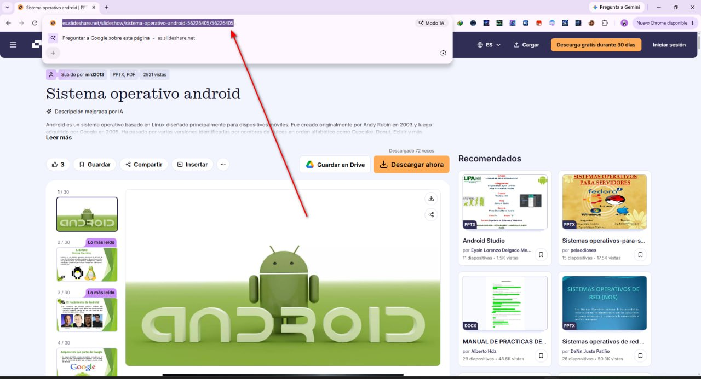
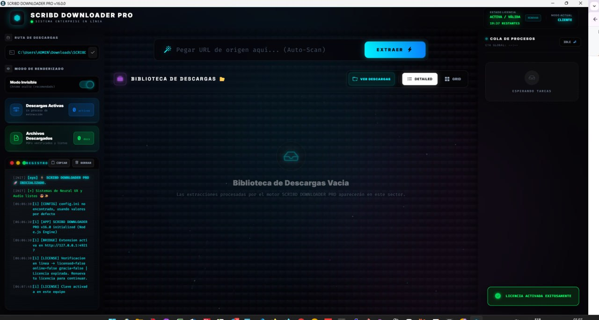
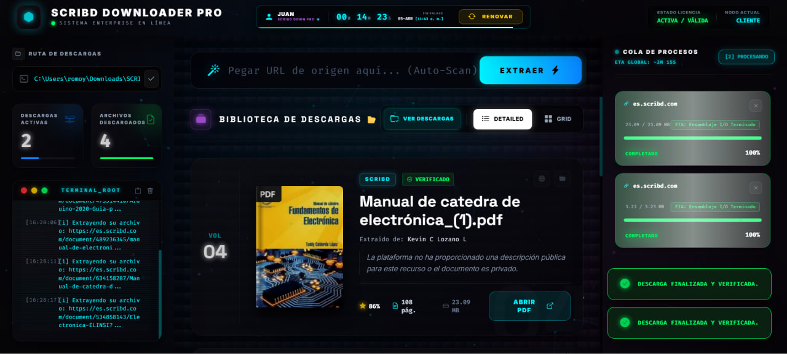
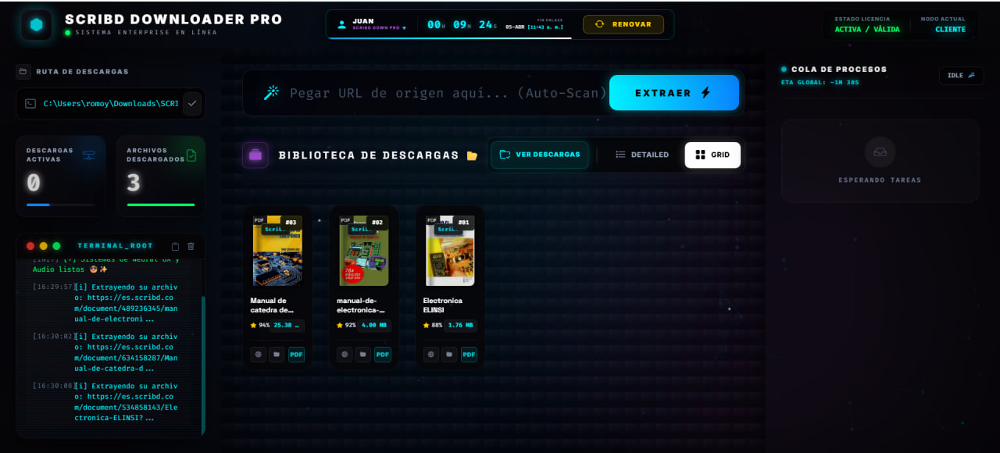

# ⚡ SCRIBD DOWNLOADER PRO 2026

### 🚀 Descarga libros de Scribd y presentaciones de SlideShare en **PDF y PPTX editables**

**📥 [DESCARGAR ÚLTIMA VERSIÓN](https://github.com/Dev-LeviathanTM/Scribd-Downloader-Pro-2026/releases/latest)** · **[🎬 VER DEMO EN VIDEO](https://www.youtube.com/watch?v=2kepwLPUVzA)** · **[💬 COMPRAR LICENCIA](https://wa.me/51962829974)**

🖥️ Interfaz principal de SCRIBD DOWNLOADER PRO v16.3.6 — modo oscuro neon, 100% en español

---

## 📦 INSTALACIÓN — GUÍA PARA PRINCIPIANTES

Elige **una sola** de estas dos formas. No necesitas saber de programación: solo sigue los pasos en orden.

### ⚙️ OPCIÓN A — Instalador (recomendada para la mayoría)

Ideal si quieres un acceso en el escritorio y que el programa se actualice solo.

1. **Abre la página de descargas**: entra a [Releases oficiales](https://github.com/Dev-LeviathanTM/Scribd-Downloader-Pro-2026/releases/latest).
2. **Descarga el instalador**: en la sección *Assets*, haz clic en **`Scribd_Downloader_Pro_Setup_v16.0.exe`**.
3. **Ejecuta el archivo**: ve a tu carpeta de *Descargas* y **doble clic** sobre el `.exe`.
4. **Permite la app** si Windows muestra el aviso *"Usuario de Windows no reconoce esta app"* → haz clic en **Sí** / **Más información** → **Ejecutar de todos modos**. (Es normal: el programa es nuevo y aún no tiene millones de descargas.)
5. **Sigue el asistente**: pulsa **Siguiente → Siguiente → Instalar → Finalizar**.
6. **Abre el programa**: aparecerá el ícono **SCRIBD DOWNLOADER PRO** en tu escritorio o en el menú Inicio. ¡Listo!

### 🗜️ OPCIÓN B — Versión Portable (sin instalar nada)

Ideal si usas una PC prestada, un USB o no quieres permisos de administrador.

1. **Abre la página de descargas**: entra a [Releases oficiales](https://github.com/Dev-LeviathanTM/Scribd-Downloader-Pro-2026/releases/latest).
2. **Descarga el ZIP**: en la sección *Assets*, haz clic en **`SCRIBD_DOWNLOADER_PRO_v16.0_PORTABLE.zip`**.
3. **Descomprime el ZIP**: clic derecho sobre el archivo → **Extraer todo…** → **Extraer**.
4. **Entra a la carpeta** `SCRIBD_DOWNLOADER_PRO_v16.0_PORTABLE`.
5. **Ejecuta el programa**: **doble clic** en **`ScribdDownloader.exe`**.
6. *(Opcional)* Crea un acceso directo: clic derecho en el `.exe` → **Enviar a** → **Escritorio (crear acceso directo)**.

> 💡 **¿Cuál elijo?** Si es tu PC personal → **Opción A**. Si es una PC temporal o un pendrive → **Opción B**.

### 🔑 Después de instalar: activa tu licencia (o prueba el DEMO gratis)

1. Abre el programa. Verás la pantalla **INGRESE LLAVE MAESTRA**.
2. **¿Tienes licencia?** Pega tu llave y pulsa **ACTIVAR LICENCIA**.
3. **¿Aún no la tienes?** Pulsa **PROBAR DEMO** para obtener **3 descargas gratis** (protegido contra abusos con la huella de tu equipo), o compra desde [WhatsApp](https://wa.me/51962829974) / [Hotmart o PayPal](https://wa.me/51962829974).

> 🛡️ La activación es **segura (RS256)**: tu clave se verifica contra el servidor oficial y queda ligada a tu PC.

---

## 🎬 MÍRALO EN ACCIÓN

  
   
  ▶️ Haz clic en la imagen para ver el programa en funcionamiento

---

## 🚀 ¿CÓMO DESCARGAR? (Paso a paso con capturas)

### Paso 1 — Copia la URL del documento

Abre el libro en **Scribd** o la presentación en **SlideShare** con tu navegador y **copia la dirección de la barra de URL** (clic derecho → Copiar, o `Ctrl + C`).

  
   📍 Copia la URL del navegador (donde dice slideshare.net/... o scribd.com/...)

### Paso 2 — Pégala en el programa y pulsa EXTRAER

Vuelve a SCRIBD DOWNLOADER PRO, **pega la URL** en el campo superior (`Ctrl + V`) y pulsa el botón **EXTRAER ⚡**. Puedes pegar varias URLs a la vez: la cola las procesa en paralelo.

### Paso 3 — Abre tu PDF o PPTX

Al terminar aparece la ficha del documento con portada, autor, páginas y peso. Pulsa **ABRIR PDF** (o **ABRIR PPTX** en SlideShare) y ¡listo! El archivo queda guardado en tu carpeta de descargas.

  
   ✅ Descarga completada: 11 páginas, 1.4 MB, listo para abrir en un solo clic

💡 ¿SlideShare sale con verificación anti-bot?

SlideShare protege su CDN. Si el programa detecta una pantalla de verificación, espera unos segundos y reintenta con el **Modo Visible** activado (menú de configuración). El motor convierte automáticamente las imágenes WebP a JPEG de alta calidad.

---

## 🔥 ¿QUÉ PUEDE HACER?

SCRIBD DOWNLOADER PRO es la herramienta definitiva para **descargar documentos de Scribd** y **convertir SlideShare a PDF y PPTX** en tu PC, sin límites y sin marcas de agua.

✅ **Descargas ilimitadas** desde Scribd y SlideShare
✅ **SlideShare → PPTX editable**: cada presentación se entrega en **PDF + PowerPoint (.pptx)** en un solo pase
✅ **Extracción automática de metadatos**: título, autor, portada, valoración real y número de páginas
✅ **Conversión a PDF** sin marcas de agua, verificada página por página
✅ **Modo demo gratis**: 3 descargas de prueba sin tarjeta (protegido por huella de equipo)
✅ **Cola inteligente**: pega varias URLs a la vez y descarga en paralelo
✅ **Interfaz oscura neon** estilo hacker, 100% en español
✅ **Sin límites** de velocidad ni IP · funciona con Chrome visible o invisible

---

## 📥 DESCARGA RÁPIDA

| Archivo | Descripción |
| :--- | :--- |
| 📀 **`Scribd_Downloader_Pro_Setup_v16.0.exe`** | Instalador oficial (recomendado) |
| 🗜️ **`SCRIBD_DOWNLOADER_PRO_v16.0_PORTABLE.zip`** | Versión portable, sin instalación |

> 👉 **[Descargar desde la página de Releases](https://github.com/Dev-LeviathanTM/Scribd-Downloader-Pro-2026/releases/latest)**

---

## 💎 PLANES DISPONIBLES (Pagos en Soles o Internacionales)

| Plan | Precio | Comprar |
| :--- | :--- | :--- |
| 📅 **1 Mes (Cliente)** | **S/10** |  |
| ♾️ **Vitalicio (Cliente)** | **S/50** |  |
| 🔥 **Revendedor (3+)** | **S/4 c/u** |  |

  

---

## 🌍 PAGOS INTERNACIONALES

🌐 ¿No eres de Perú? Puedes comprar desde **cualquier país** mediante **Hotmart** o **PayPal**.

---

## 💬 ¿CÓMO COMPRAR?

  
    
  <a href="https://wa.me/51962829974" style="display: inline-block; padding: 12px 25px; background-color: #25D366; color: white; text-decoration: none; border-radius: 30px; font-weight: bold; font-size: 1.2rem;">
    📲 ¡Escríbeme ahora por WhatsApp!
  </a>

---

## 🤝 ¿QUÉ INCLUYE TU COMPRA?

✅ **Instalación** paso a paso en tu laptop
✅ **Activación** del sistema de licencias (seguro RS256)
✅ **Panel de control** para revendedores (si aplica)
✅ **Actualizaciones gratis** mientras tu licencia esté activa
✅ **Soporte técnico** por si algo falla

---

## 🆕 NOVEDADES v16.0

- 🆕 **SlideShare → PPTX**: genera PowerPoint editable junto al PDF en la misma descarga
- 🆕 **Modo demo**: 3 descargas gratis por equipo con protección anti-fraude (huella de equipo: MAC, registro de Windows, CPU/placa/disco)
- 🛡️ **Licencias RS256**: tokens firmados con criptografía asimétrica — imposible de forjar
- 🐛 **Fix SlideShare**: conversión automática WebP → JPEG (corrige *"SOI not found in JPEG"*)
- ⚡ Aviso claro si SlideShare activa verificación anti-bot

---

## ❓ PREGUNTAS FRECUENTES (FAQ)

**❓ ¿Es gratis?**
Sí, puedes probarlo con el **modo demo (3 descargas)**. Los planes de pago desbloquean descargas ilimitadas.

**❓ ¿Funciona en Windows 10 y 11?**
Sí, compatible con **Windows 10 y Windows 11** (64 bits).

**❓ ¿Necesito instalar algo más?**
No. El programa trae todo incluido (motor Chrome embebido). Solo necesitas una conexión a internet.

**❓ ¿Qué diferencia hay entre Instalador y Portable?**
Ninguna en funciones. El **instalador** crea accesos directos; la **portable** se ejecuta desde cualquier carpeta sin instalar.

**❓ ¿Puedo usarlo en varias PC?**
Depende del plan: el plan mensual/vitalicio es para **1 equipo**; el plan **revendedor** permite activar varios equipos.

**❓ ¿Por qué Windows muestra un aviso al abrirlo?**
Es normal: los programas independientes sin certificado comercial activan el SmartScreen. Pulsa **Más información → Ejecutar de todos modos**.

---

## 🛠️ TECNOLOGÍAS

---

> ⚠️ **AVISO IMPORTANTE:** Este repositorio contiene únicamente el **ejecutable compilado** y la documentación. El código fuente es **privado** para proteger el sistema de licencias. Úsalo únicamente con contenido del que seas propietario o con fines de estudio personal.

---

**🔎 Términos de búsqueda:** *descargar libros de Scribd* · *Scribd downloader* · *SlideShare a PDF* · *descargar presentaciones de SlideShare* · *SlideShare a PowerPoint* · *bajar documentos de Scribd gratis* · *convertir SlideShare a PPTX* · *SCRIBD DOWNLOADER PRO 2026* · *descargar Scribd gratis Windows* · *pasar SlideShare a PowerPoint* · *lector de libros en PDF*

🚀 Desarrollado con ❤️ para la comunidad hispanohablante

